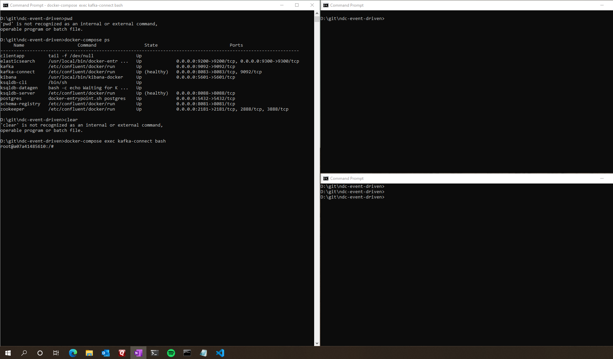
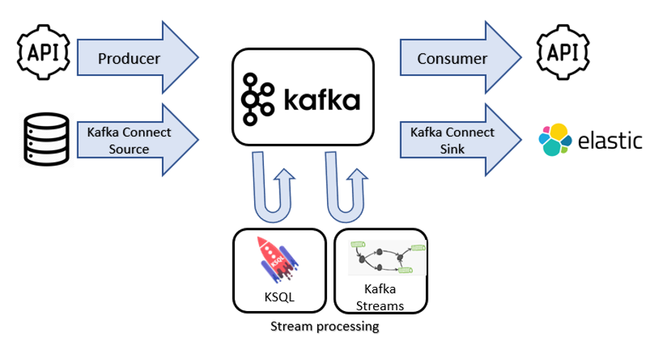
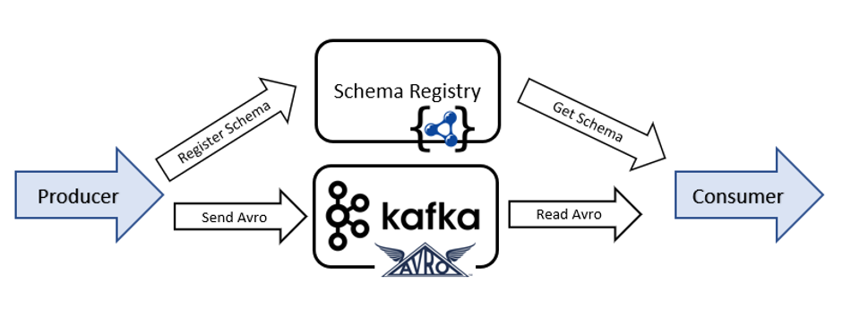

# Introduction


[NDC Melbourne Workshop ](https://ndcmelbourne.com/talk/workshop-event-driven-all-roads-lead-to-kafka/) Event driven : All roads lead to Kafka

### Build a taxi booking application with Apache Kafka. 

During this workshop we’ll discuss what Kafka is and how to use this exciting, modern distributed streaming platform in your next data project. From the ground up we'll build a practical data management system to stream data, aggregate results and deliver live visual mapping of a taxi booking application.

This hands-on labs you’ll build an application that can
- Publish data to Kafka and subscribe to consume data from Kafka
- Serialize data in AVRO and Protobuf
- Register schemas and handle changes with schema evolution
- Leverage APIs in for producing and consuming messages against Kafka topics
- Build topologies to transform and aggregate streaming payloads
- Understand the Kafka connect framework to easily connect to external databases and elastic
- Build a live mapping dashboard with Kibana

This workshop is ideal for application developers, data engineers, or data scientists who need to interact with distributed messaging and streaming data platforms.


# Get started

## Prerequisites & setup

- install docker/docker-compose
- set your Docker maximum memory to something really big, such as 10GB. (preferences -> advanced -> memory)
- clone this repo!

```console
mkdir ~/git
cd ~/git
git clone https://github.com/saubury/ndc-event-driven.git
cd ndc-event-driven
```

## How you'll work
You'll need _three_ terminals for these exercises. Each one you should `cd ~/git/ndc-event-driven`

For simplicity arrange your three terminals so you can see the first and second at the same time (perhaps split horizontally if you're using iTerm2) Something like below.



## Docker Startup
**Terminal 1**
```console
docker-compose up -d 
```


# Workshop 1 – Producers and Consumers



**Terminal 1**
```console
docker-compose exec kafka-connect bash
```

Create a topic
```console
kafka-topics --bootstrap-server kafka:29092 --create --partitions 1 --replication-factor 1 --topic MYTOPIC
```

Check it's there 
```console
kafka-topics --list --bootstrap-server kafka:29092
```

Create a topic with 8 partitions
```console
kafka-topics --bootstrap-server kafka:29092 --create --partitions 8 --replication-factor 1 --topic MYTOPIC8
```

Describe a topic - check it has 8 partitions
```console
kafka-topics --describe --bootstrap-server kafka:29092 --topic MYTOPIC8
```

Create a topic with replication greater than number of brokers
```console
kafka-topics --bootstrap-server kafka:29092 --create --replication-factor 2 --topic MYTOPIC_REPLICATED
```

*Create a Producer*

Write some text from STDIN

```console
kafka-console-producer --broker-list kafka:29092 --topic MYTOPIC
```

Now type some things into first (original) terminal (and press ENTER).  


**Terminal 2**

*Create a Consumer*

Start another terminal
```console
docker-compose exec kafka-connect bash
```

In the newly created (second) terminal let's start reading from new Kafka topic
```console
kafka-console-consumer --bootstrap-server kafka:29092 --topic MYTOPIC 
```
Each line you type in the first terminal should appear in second terminal. Note we're only getting the "new" messages

**Terminal 3**

*Create a Consumer*

Start yet another terminal
```console
docker-compose exec kafka-connect bash
```

In the newly created (third) terminal let's start reading from new Kafka topic
```console
kafka-console-consumer --bootstrap-server kafka:29092 --topic MYTOPIC --from-beginning
```
Each line you type in the first terminal should appear in third terminal. Note we're only getting the "old" *and* "new" messages


What have we learnt?  It's easy to be a producer or consumer.  Out of the box Kafka doesn't care what you're writing - it's just a bunch of bytes

# Workshop 2 – Structured Data 

## Structured Data with AVRO





**Terminal 1**

At UNIX prompt, (Note: Press Ctrl C to exit the producer script)
```console
kafka-topics --bootstrap-server kafka:29092 --create --partitions 1 --replication-factor 1 --topic COMPLAINTS_AVRO

kafka-avro-console-producer  --broker-list kafka:29092 --property schema.registry.url="http://schema-registry:8081"  --topic COMPLAINTS_AVRO \
--property value.schema='
{
  "type": "record",
  "name": "myrecord",
  "fields": [
      {"name": "customer_name,  "type": "string" }
    , {"name": "complaint_type", "type": "string" }
    , {"name": "trip_cost", "type": "float" }
  ]
}' << EOF
{"customer_name":"Carol", "complaint_type":"Late arrival", "trip_cost": 19.60, "new_customer": false}
EOF
```

**Terminal 2**

Press Ctrl+C and Ctrl+D and run the following curl command.

Start yet another terminal
```console
docker-compose exec clientapp bash
```

BTW, this is AVRO

```console
curl -s -X GET http://schema-registry:8081/subjects/COMPLAINTS_AVRO-value/versions/1
```

We can use `jq` to make this easier to read
```bash
apt-get install -y jq

curl -s -X GET http://schema-registry:8081/subjects/COMPLAINTS_AVRO-value/versions/1 | jq '.schema | fromjson'
```


## AVRO Schema Evolution
Let's add a loyality concept to our complaints topic - we'll add "number_of_rides" to the payload

**Terminal 1** 

```console
kafka-avro-console-producer  --broker-list kafka:29092 --property schema.registry.url="http://schema-registry:8081"  --topic COMPLAINTS_AVRO \
--property value.schema='
{
  "type": "record",
  "name": "myrecord",
  "fields": [
      {"name": "customer_name",  "type": "string" }
    , {"name": "complaint_type", "type": "string" }
    , {"name": "trip_cost", "type": "float" }
    , {"name": "new_customer", "type": "boolean"}
    , {"name": "number_of_rides", "type": "int", "default" : 1}
  ]
}' << EOF
{"customer_name":"Ed", "complaint_type":"Dirty car", "trip_cost": 29.10, "new_customer": false, "number_of_rides": 22}
EOF
```

**Terminal 2**

Let's see what schemas we have registered now
```console
curl -s -X GET http://schema-registry:8081/subjects/COMPLAINTS_AVRO-value/versions

curl -s -X GET http://schema-registry:8081/subjects/COMPLAINTS_AVRO-value/versions/1 | jq '.'

curl -s -X GET http://schema-registry:8081/subjects/COMPLAINTS_AVRO-value/versions/2 | jq '.'

or you can also use:

curl -s -X GET http://schema-registry:8081/subjects/COMPLAINTS_AVRO-value/versions/2 | jq -r .schema | jq .

```

# Workshop 3 – Kafka Connect

Let's copy data from an upstream database which has a list of ride users.  Connecting Kafka to and from other systems (such as a database or object store) is a very common task.  The Kafka Connect framework has a plug in archecture which allows you to _source_ from an upstream system or _sink_ into a downstream system.  

## Setup Postgres source database

**in Terminal 1:** 

Exit the kafka-connect container by pressing Ctrl+D.

```console
cat scripts/postgres-setup.sql

docker-compose exec postgres psql -U postgres -f /scripts/postgres-setup.sql
```

To look at the Postgres table
```console
docker-compose exec postgres psql -U postgres -c "select * from users;"
```


## Kafka Connect Setup
Our goal now is to source data continuously from our Postgres database and produce into Kafka.  We'll use Kafka connect as the framework, and a JDBC Postgres Source connector coto connect to the database


Have a look at `scripts/connect_source_postgres.json`

```console
# Mac
cat scripts/connect_source_postgres.json

# Windows
type scripts\connect_source_postgres.json
```


Load connect config

```bash
docker-compose exec clientapp bash
 ```

```console
curl -k -s -S -X PUT -H "Accept: application/json" -H "Content-Type: application/json" --data @./scripts/connect_source_postgres.json http://kafka-connect:8083/connectors/src_pg/config
```

```
curl -s -X GET http://kafka-connect:8083/connectors/src_pg/status | jq '.'
```

**Terminal 2**

Now let's consume the topic by starting a consumer inside the kafka-connect container to 

```console
kafka-avro-console-consumer --bootstrap-server kafka:29092 --topic db-users --from-beginning --property  schema.registry.url="http://schema-registry:8081"
```

**Terminal 1**

Insert a new database row into Postgres
```console
docker exec -it postgres psql -U postgres -c "INSERT INTO users (userid, username) VALUES ('J', 'Jane');"
```
You _should_ see Jane arrive automatically into the Kafka topic


# Workshop 4 – Stream Processing

## Generate ride request data
Create a stream of rider requests

**Terminal 3**
```console
docker-compose exec ksqldb-datagen ksql-datagen schema=/scripts/riderequest.avro  format=avro topic=riderequest key=rideid msgRate=1 iterations=10 bootstrap-server=kafka:29092 schemaRegistryUrl=http://schema-registry:8081 value-format=avro
```

In Terminal 2, (Exit the existing consumer by pressing Ctrl+C) 
Check the AVRO output of the `riderequest` topic. Press ^C when you've seen a few records.

```console
kafka-avro-console-consumer --bootstrap-server kafka:29092 --topic riderequest --from-beginning --property  schema.registry.url="http://schema-registry:8081"
```

## Build a stream processor
We have a constant steam of rider requests arriving in the `riderequest` topic.  But each request has only a `userid` (such as `J`) and no name (like `Jane`).  Also, the rider location has seperate latitide and longtitude fields; we want to be able to join them together as single string field (to form a geom - `cast(rr.LATITUDE as varchar) || ',' || cast(rr.LONGITUDE as varchar)`)

Let's build a stream processor to consume from the `riderequest` topic and `db-users` topics, join them and produce into a new topic along with a new location attribute.  

Will build our stream processor in ksql.

## ksqlDB CLI
Build a stream processor 

**Terminal 2**

```console
docker-compose exec ksqldb-cli ksql http://ksqldb-server:8088
```

Run the KSQL script: 

```console
ksql
ksql> run script '/scripts/join_topics.ksql';
exit;

```

And if you want to check

**Terminal 1** from inside the Kafka-connect container
```console
kafka-console-consumer --bootstrap-server kafka:29092 --topic RIDESANDUSERSJSON
```

# Workshop 5 – Visualizations

## Sink to Elastic/Kibana
Setup dynamic elastic templates

**Terminal 2**

At the console prompt

```console
./scripts/load_elastic_dynamic_template
```

Now we need a sink connector to read from the topic RIDESANDUSERSJSON

Load connect config.
```console
curl -k -s -S -X PUT -H "Accept: application/json" -H "Content-Type: application/json" --data @./scripts/connect_sink_elastic.json http://localhost:8083/connectors/sink_elastic/config
```

```console
curl -s -X GET http://localhost:8083/connectors/sink_elastic/status | jq '.'
```

## Kibana Dashboard Import

- Navigate to http://localhost:5601/app/kibana#/management/kibana/objects
- Click Import
- Select file 06_kibana_export.json
- Click Automatically overwrite all saved objects? and select Yes, overwrite all objects
- Kibana - Open Dashboard
- Open http://localhost:5601/app/kibana#/dashboards


# Workshop 6 – Producers & Protobuf

Build a Python producer

## Application Binding - Protobuf classes with Python
Let us now build an application demonstrating protobuf classes.  


```console
docker-compose exec clientapp bash
```

## Generate protobuf classes
To generate protobuf classes you must first install the protobuf compiler `protoc`.  See the [protocol buffer docs](https://developers.google.com/protocol-buffers/docs/pythontutorial) for instructions on installing and using protoc.

### Python compile schema

```console
cd /python-app
cat ./meal.proto
```

```bash
protoc -I=. --python_out=. ./meal.proto
```

This will create the `meal_pb2.py` Python class file.  

You can now build protobuf classes and produce into Kafka with code like this

```bash
pip install -r requirements.txt
```

Review the producer code. Note the `meal_pb2.py` Python class file is included. This class is used to construct a payload in protobuf. The produecr will send the schema to the schema registry and the payload to the `MEAL_DELIVERY` topic.

```bash
cat producer-protobuf.py
```

Run the producer
```bash
python producer-protobuf.py
```

### Review the topic
Now to check the contents of the `MEAL_DELIVERY` topic. We will use the `kafka-protobuf-console-consumer` command line consumer tool to inspect the protobuf payload.

```console
docker-compose exec kafka-connect bash
```

```console
kafka-protobuf-console-consumer --bootstrap-server kafka:29092 --topic MEAL_DELIVERY --from-beginning --property  schema.registry.url="http://schema-registry:8081"
```

## Verify schema 
Check this is Protobuf

```console
curl -s -X GET http://localhost:8081/subjects/MEAL_DELIVERY-value/versions/1
```
